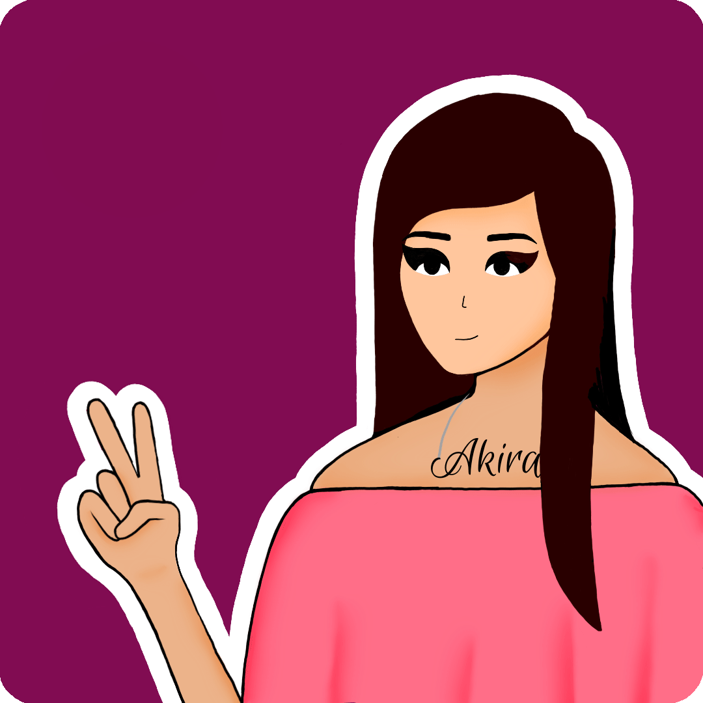

 

<!-- 

free gifts fr u, patreon, buy a coffee

 -->

<h1>About me :woman:</h1>

I am Pooja Agarwal (a.k.a. Akira), a 3rd year BTech student at Kalinga Institute of Industrial Technology. I am a content creator, an enthusiast AR developer, and a self-taught digital artist. I love creating and exploring new things. I also enjoy traditional art, animating, dancing, and singing. 
Additionally, being from a computer science background, I also have a great interest in designing websites and making android applications. I have knowledge about major programming languages like C++, Java, C, Python, HTML and CSS. 
I am genuinely delighted to gather information by reading articles or watching videos that focuses on less discussed but very important topics.

- 🔭 I’m currently working on my portfolio website 
- 🌱 I’m currently learning to make AR filters  
- 💬 Talk to me about anything 
- 😄 Pronouns: she/her 

---
<h1>GitHub stats :chart_with_upwards_trend:</h1>

<table style="border-collapse: collapse; width: 100%;">
<tr>
<td colspan="2" align="center"></td>
</tr>
<tr>
<td align="center">
</td>
<td align="center"></td>
</tr>
<tr>
<td colspan="2" align="center">
</td>
</tr>
</table>

---

<h1>Skillset :woman_technologist:</h1>

---

<h1>Softwares and Tools :computer:</h1>

---

<h1>Connect with me :handshake:</h1>

